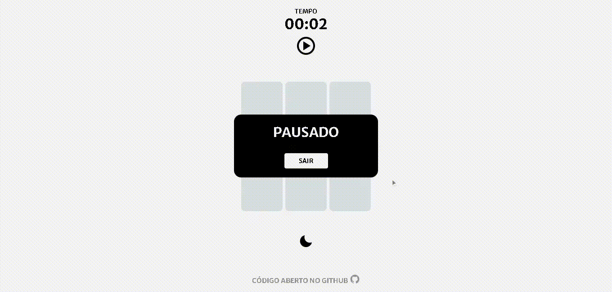
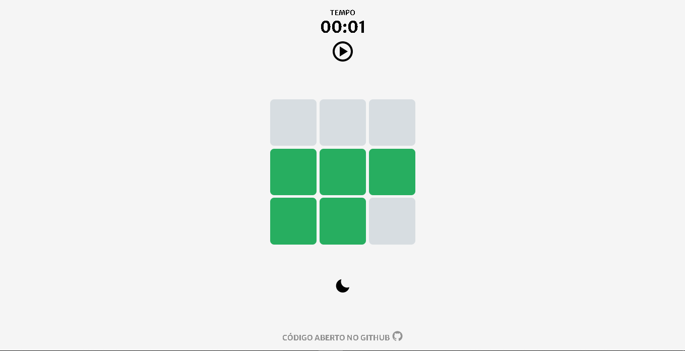

# Tile Memory

Memorize a posição das cores

## Screenshots

## ✨ Inspirações

https://dribbble.com/shots/4952965-Gameplay-Interaction

## 💻 Como rodar o projeto localmente

1. Clone o projeto
2. Dentro do projeto rode `npm install`
3. Use `npm run dev` para iniciar

## 🧰 Sobre o jogo

### Opções

-  Modo de jogo (Sequencia, Aleatório)
-  Dificuldade (Fácil, Médio, Difícil)
-  Tamanho do tabuleiro (3x3, 4x4, 5x5)
-  Modo sem fim (Checkbox)

## 🤝 Contribuições

Projeto totalmente aberto a contribuições
Lembre de seguir os requisitos da licença...
